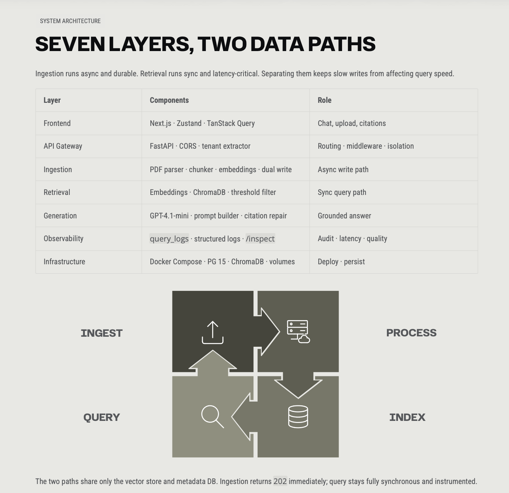
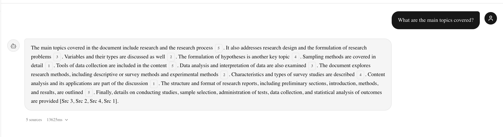
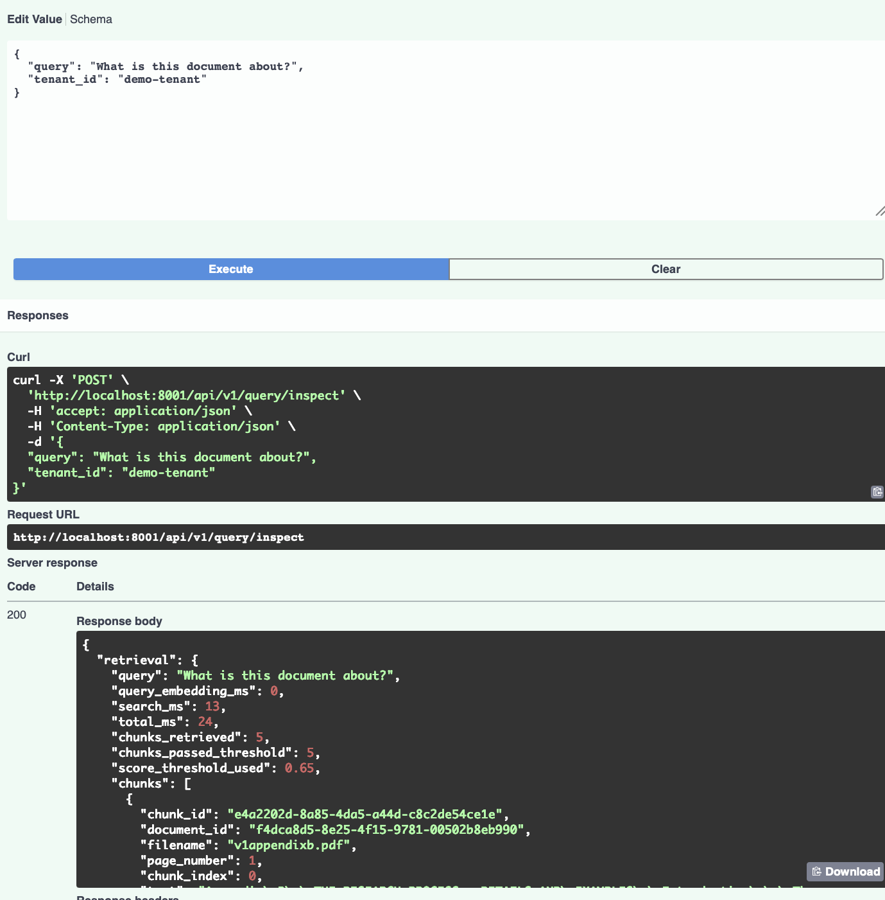
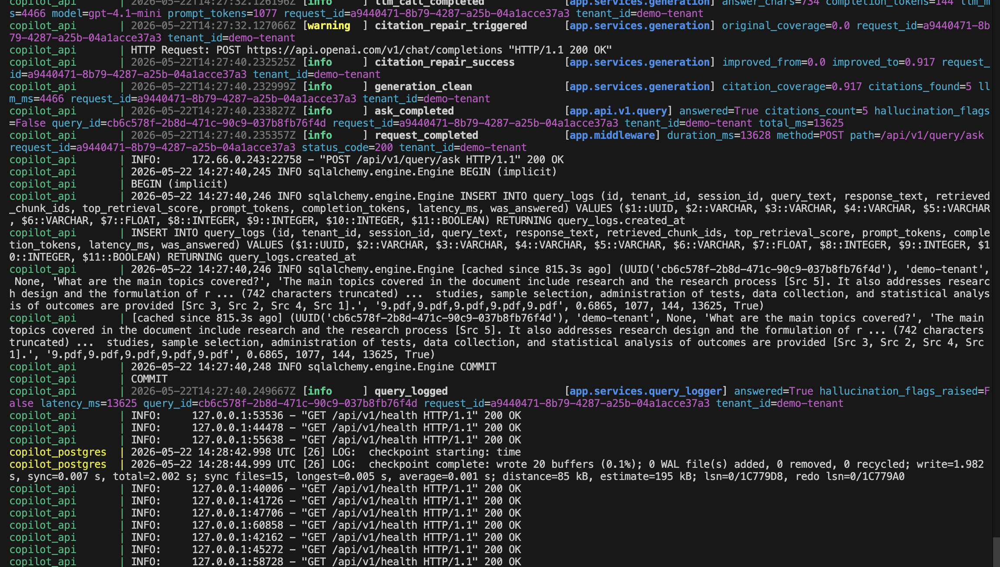

# AI Support Copilot

Production-grade Retrieval-Augmented Generation (RAG) platform with semantic search, grounded citations, observability tooling, and multi-tenant isolation.

---

## Engineering Case Study

- [Condensed Project Brief](docs/report/ai-support-copilot-brief.pdf)
- [Detailed Architecture Report](docs/report/architecture-case-study.pdf)

---

## Features

- Async PDF ingestion pipeline
- Semantic chunking
- OpenAI embeddings
- ChromaDB vector retrieval
- Citation-grounded generation
- Citation repair loop
- Retrieval inspector endpoint
- Query observability & audit logging
- Multi-tenant namespace isolation
- Dockerized infrastructure

---

## Stack

| Layer | Technologies |
|---|---|
| Frontend | Next.js 14, TypeScript, Zustand, TanStack Query |
| Backend | FastAPI, Python async |
| Databases | PostgreSQL, ChromaDB |
| AI | OpenAI GPT-4.1-mini, text-embedding-3-small |
| Infra | Docker Compose |

---

## Architecture



---

## Retrieval Pipeline

```text
Query
 → Embed
 → Vector Search
 → Threshold Filtering
 → Context Assembly
 → GPT Generation
 → Citation Repair
 → Response
```

---

## Screenshots

### Grounded Chat + Citations



---

### Retrieval Inspector



---

### Observability & Logs



---

## Local Setup

### Backend

```bash
cd backend/backendingestionpipeline
docker compose up --build
```

### Frontend

```bash
cd frontend/support-copilot-ui
npm install
npm run dev
```

---

## Key Engineering Learnings

- Retrieval quality mattered more than prompt engineering
- Tenant isolation bugs were difficult to detect locally
- Citation repair significantly improved grounding reliability
- Async ingestion simplified frontend UX substantially
- Observability accelerated debugging and iteration speed

---

## Roadmap

- SSE streaming responses
- Re-ranking stage
- Redis/Celery ingestion queue
- JWT auth
- Production deployment
- Evaluation dashboard